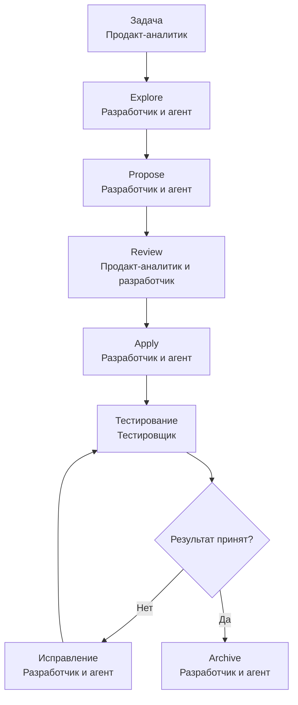

# Базовый процесс разработки по OpenSpec

**Читатель:** продакт-аналитик, разработчик и тестировщик.  
**Назначение:** установить порядок выполнения одной задачи с использованием стандартной схемы OpenSpec `spec-driven`.  
**Ожидаемый результат:** каждая роль понимает свою ответственность, входные и выходные данные этапов и используемые навыки OpenSpec.  
**Граница:** документ использует только стандартные артефакты и профиль `core`. Пользовательские схемы, дополнительные документы и необязательный навык `openspec-verify-change` не применяются.  
**Статус:** черновик.  
**Профиль:** нормативный процесс; открытые вопросы вынесены наружу; соответствие реальному проекту не проверено.

## 1. Роли

| Роль             | Ответственность в процессе                                                                                                                            |
| ---------------- | ----------------------------------------------------------------------------------------------------------------------------------------------------- |
| Продакт-аналитик | Формулирует задачу и принимает продуктовые решения. Отвечает за проблему, цель, границы и требуемое поведение продукта.                               |
| Разработчик      | Управляет AI-агентами и процессом OpenSpec. Отвечает за технический анализ, планирование, архитектуру, реализацию и актуальность артефактов OpenSpec. |
| Тестировщик      | Проверяет результат разработки. Отвечает за независимую проверку реализованного поведения и регистрацию обнаруженных дефектов.                        |

OpenSpec не назначает организационные роли. Приведённое распределение устанавливает процесс команды.

## 2. Граница OpenSpec и процесса команды

Стандартный цикл OpenSpec содержит пять стадий:

```text
Explore → Propose → Review → Apply → Archive
```

В процессе команды к нему добавляются два внешних контрольных этапа:

1. Продакт-аналитик ставит задачу до начала работы в OpenSpec.
2. Тестировщик проверяет результат после `Apply` и до `Archive`.

Эти этапы не создают дополнительных артефактов OpenSpec и не изменяют стандартную схему `spec-driven`.

## 3. Артефакты стандартной схемы

| Артефакт | Назначение | Ответственный за содержание |
|---|---|---|
| `.openspec.yaml` | Метаданные изменения и выбранная схема | Разработчик |
| `proposal.md` | Причина и общий состав изменения, новые и изменяемые возможности, влияние на систему | Продакт-аналитик отвечает за продуктовый смысл; разработчик — за корректность артефакта и техническое влияние |
| `specs/<capability-path>/spec.md` | Дельта проверяемого поведения системы | Продакт-аналитик отвечает за продуктовое поведение; разработчик — за структуру, техническую согласованность и связь с действующими спецификациями |
| `design.md` | Технический способ реализации, решения, риски и компромиссы | Разработчик |
| `tasks.md` | Проверяемые задачи реализации | Разработчик |

`design.md` может отсутствовать, если изменение не требует отдельного технического проектирования. Для изменения без новых или изменяемых требований допускается `skip_specs: true`; в таком случае дельты `specs/` не создаются.

## 4. Общая последовательность



## 5. Этап 0. Подготовка проекта

### Ответственность

**Владелец этапа:** разработчик.

Разработчик отвечает за установку OpenSpec, выбор поддерживаемого AI-инструмента и инициализацию OpenSpec в репозитории. Продакт-аналитик и тестировщик в подготовке среды не участвуют.

### Входные данные

- репозиторий продукта;
- выбранный AI-инструмент;
- доступ разработчика к локальной среде и репозиторию.

### Действия

1. Разработчик устанавливает OpenSpec CLI.
2. Разработчик выполняет `openspec init` в проекте.
3. Разработчик проверяет, что установлен стандартный профиль `core`.
4. Разработчик проверяет доступность стандартной схемы `spec-driven`.

### Используемый навык

Навык OpenSpec не используется. Это предварительная настройка среды.

### Выходные данные

- инициализированная структура `openspec/`;
- установленные навыки профиля `core`;
- доступная схема `spec-driven`.

### Условие завершения

Навыки OpenSpec распознают корень проекта и могут создавать изменения.

## 6. Этап 1. Постановка задачи

### Ответственность

**Владелец этапа:** продакт-аналитик.

Продакт-аналитик отвечает за полноту продуктовой постановки. Разработчик проверяет, можно ли передать задачу агенту без самостоятельного принятия продуктовых решений.

### Входные данные

- проблема или продуктовая возможность;
- результаты исследований и принятые продуктовые решения;
- действующие бизнес-требования и ограничения, если они существуют.

### Действия продакт-аналитика

Продакт-аналитик передаёт разработчику задачу, в которой зафиксированы:

- проблема;
- ожидаемый результат;
- пользователи или внешние системы;
- границы задачи;
- обязательное поведение;
- продуктовые ограничения;
- критерии приёмки;
- известные ошибочные и пограничные случаи.

### Действия разработчика

Разработчик проверяет, достаточно ли постановки, чтобы определить одно изменение. Если отсутствует решение, влияющее на поведение или границы, разработчик возвращает вопрос продакт-аналитику.

Разработчик не заменяет отсутствующее продуктовое решение предположением агента.

### Используемый навык

Навык OpenSpec не используется. Исходная задача является внешним входом для OpenSpec.

### Выходные данные

- готовая продуктовая задача;
- закрытые продуктовые вопросы, блокирующие исследование и планирование.

### Условие завершения

Разработчик может однозначно передать агенту проблему, требуемый результат и границы изменения.

## 7. Этап 2. Исследование — `Explore`

### Ответственность

**Владелец этапа:** разработчик.

Разработчик управляет исследованием и отвечает за технические выводы. Продакт-аналитик отвечает на вопросы, которые требуют нового продуктового решения. Тестировщик на этапе не участвует.

### Входные данные

- задача продакт-аналитика;
- действующие спецификации из `openspec/specs/`;
- кодовая база;
- известные технические ограничения.

### Используемый навык

`openspec-explore`

Навык входит в стандартный профиль `core`. Этап можно пропустить, если задача и затрагиваемые области уже однозначно определены.

### Действия AI-агента

Агент:

- исследует действующие спецификации и код;
- определяет затрагиваемые возможности и компоненты;
- выявляет зависимости, ограничения и противоречия;
- сравнивает варианты границ изменения;
- формулирует вопросы;
- не изменяет код.

По умолчанию `openspec-explore` не создаёт файлы.

### Действия разработчика

Разработчик:

- проверяет технические выводы агента;
- принимает технические решения в пределах своей ответственности;
- передаёт продакт-аналитику вопросы о поведении, цели или границах;
- определяет, готово ли изменение к созданию предложения.

### Выходные данные

- уточнённое понимание изменения;
- перечень затрагиваемых возможностей и компонентов;
- выявленные ограничения и зависимости;
- закрытые блокирующие вопросы.

Результат существует в контексте диалога с агентом и не является отдельным стандартным документом OpenSpec.

### Условие завершения

Разработчик понимает техническую область изменения, а продакт-аналитик закрыл вопросы, меняющие продуктовый смысл.

## 8. Этап 3. Создание предложения — `Propose`

### Ответственность

**Владелец этапа:** разработчик.

Разработчик запускает навык, управляет агентом и отвечает за комплектность результата. AI-агент создаёт черновики артефактов. Продакт-аналитик не управляет агентом, но предоставляет ответы на возникающие продуктовые вопросы.

### Входные данные

- готовая продуктовая задача;
- результаты `Explore`, если этап выполнялся;
- действующие спецификации;
- кодовая база и технические ограничения.

### Используемый навык

`openspec-propose`

### Действия AI-агента

Агент создаёт изменение в `openspec/changes/<change-name>/` и формирует артефакты в порядке зависимостей:

1. `.openspec.yaml`;
2. `proposal.md`;
3. дельты `specs/`;
4. `design.md`, если требуется техническое проектирование;
5. `tasks.md`.

Агент не пишет код на этом этапе.

### Действия разработчика

Разработчик:

- проверяет имя и границу изменения;
- контролирует выбор новых и изменяемых возможностей;
- проверяет техническое влияние;
- не разрешает агенту подменять отсутствующие продуктовые решения.

### Выходные данные

```text
openspec/changes/<change-name>/
├── .openspec.yaml
├── proposal.md
├── specs/
│   └── <capability-path>/
│       └── spec.md
├── design.md
└── tasks.md
```

Условные артефакты могут отсутствовать на основаниях, предусмотренных стандартной схемой.

### Условие завершения

Комплект создан, но реализация ещё не начата. Артефакты готовы к проверке людьми.

## 9. Этап 4. Проверка и исправление плана — `Review`

### Ответственность

**Совместный этап:** продакт-аналитик и разработчик отвечают за разные части результата.

Тестировщик на этапе не участвует, поскольку в принятой модели он проверяет результат разработки.

### Входные данные

- исходная продуктовая задача;
- `proposal.md`;
- дельты `specs/`;
- `design.md`, если создан;
- `tasks.md`.

### Используемый навык

Для самой проверки отдельного навыка нет. Если требуются исправления, разработчик использует `openspec-update-change`.

### Ответственность продакт-аналитика

Продакт-аналитик проверяет:

- в `proposal.md` правильно переданы проблема, цель и состав изменения;
- границы не расширены и не сужены;
- в `specs/` отражено требуемое наблюдаемое поведение;
- обязательные, ошибочные и пограничные сценарии не потеряны;
- агент не добавил неутверждённую функциональность.

Продакт-аналитик принимает решения только о продуктовой части. Он не утверждает архитектуру и внутреннюю декомпозицию реализации.

### Ответственность разработчика

Разработчик проверяет:

- `proposal.md` соответствует размеру одного управляемого изменения;
- список возможностей соответствует действующим спецификациям;
- `specs/` описывают поведение, а не внутреннюю реализацию;
- `design.md` содержит необходимые технические решения, ограничения и риски;
- `tasks.md` покрывает спецификации и не добавляет лишнюю функциональность;
- у задач указан проверяемый результат;
- все артефакты согласованы между собой.

### Исправление плана

Разработчик запускает `openspec-update-change` и указывает требуемое исправление. Агент предлагает изменения только затронутых существующих артефактов. Разработчик подтверждает каждое изменение.

Если исправление меняет продуктовый смысл, продакт-аналитик повторно проверяет соответствующий фрагмент. Если исправление относится только к технической реализации, решение принимает разработчик.

### Выходные данные

- согласованные `proposal.md` и `specs/`;
- утверждённое разработчиком техническое решение;
- полный и согласованный `tasks.md`;
- отсутствие блокирующих вопросов.

### Условие завершения

Продакт-аналитик подтвердил продуктовый смысл и поведение. Разработчик подтвердил техническую реализуемость и план. После этого можно начинать изменение кода.

## 10. Этап 5. Реализация — `Apply`

### Ответственность

**Владелец этапа:** разработчик.

Разработчик отвечает за действия AI-агентов, качество кода, технические решения и соответствие реализации согласованным артефактам. Продакт-аналитик и тестировщик на этапе реализации не управляют агентами.

### Входные данные

- согласованный каталог изменения;
- `proposal.md`;
- дельты `specs/` либо `skip_specs: true`;
- `design.md`, если создан;
- `tasks.md`.

### Используемый навык

`openspec-apply-change`

### Действия AI-агента

Агент:

- читает артефакты изменения;
- выполняет пункты `tasks.md` по порядку;
- изменяет код и другие файлы, предусмотренные задачами;
- выполняет указанные в задачах проверки;
- создаёт тесты и документацию только там, где этого требует `tasks.md`;
- отмечает завершённые задачи как `- [x]`;
- останавливается при противоречии, ошибке или нехватке решения.

### Действия разработчика

Разработчик:

- контролирует изменения агента;
- проверяет код и результаты выполнения задач;
- принимает возникающие технические решения;
- не разрешает агенту менять согласованное поведение без обновления плана;
- обеспечивает выполнение всех необходимых пунктов `tasks.md`.

Если реализация выявила ошибку плана, разработчик сначала использует `openspec-update-change` для исправления затронутых артефактов, затем продолжает `openspec-apply-change`.

### Выходные данные

- реализованный код;
- тесты, документация и другие результаты, предусмотренные `tasks.md`;
- обновлённый `tasks.md` с состоянием выполнения;
- сборка или версия продукта, готовая к проверке тестировщиком.

### Условие завершения

Разработчик завершил требуемые задачи, проверил изменения и передал тестировщику работоспособный результат.

## 11. Этап 6. Тестирование результата

### Ответственность

**Владелец этапа:** тестировщик.

Тестировщик отвечает за независимую проверку результата и регистрацию обнаруженных дефектов. Разработчик предоставляет сборку, среду и техническую информацию. Продакт-аналитик принимает решения только при обнаружении неоднозначности или пробела в требуемом поведении.

### Входные данные

- исходная задача продакт-аналитика;
- готовая сборка или доступная реализация;
- `proposal.md`;
- дельты `specs/`;
- результаты проверок, предусмотренных `tasks.md`;
- сведения о затронутых областях.

### Используемый навык

Навык OpenSpec не используется. Стандартный профиль `core` не содержит отдельного этапа тестирования.

### Действия тестировщика

Тестировщик:

- проверяет требования и сценарии из `specs/`;
- проверяет соответствие результата исходной задаче;
- выполняет необходимые функциональные, интеграционные и регрессионные проверки;
- проверяет ошибочные и пограничные случаи;
- проверяет результаты автоматических тестов, если они предусмотрены;
- регистрирует дефекты в принятой командой системе.

Основным источником ожидаемого поведения являются `specs/`. `design.md` описывает техническое решение, а `tasks.md` — ход реализации, поэтому они не заменяют спецификацию при проверке результата.

### Классификация найденных проблем

| Тип проблемы | Кто принимает решение | Следующее действие |
|---|---|---|
| Реализация не соответствует согласованным `specs/` | Разработчик | Исправить код через `openspec-apply-change` |
| Технический план содержит ошибку | Разработчик | Исправить затронутые артефакты через `openspec-update-change`, затем продолжить `openspec-apply-change` |
| Требуемое поведение не определено или противоречиво | Продакт-аналитик | Принять продуктовое решение; разработчик обновляет затронутые артефакты и реализацию |

После исправления разработчик повторно передаёт результат тестировщику.

### Выходные данные

- решение тестировщика о результате проверки;
- зарегистрированные дефекты, если они найдены;
- перечень повторных проверок после исправлений.

OpenSpec не определяет формат этих данных. Они хранятся в принятой командой системе тестирования или управления задачами. Дополнительные файлы могут находиться в каталоге изменения, но стандартная схема не считает их своими артефактами и не управляет ими.

### Условие завершения

Тестировщик подтвердил отсутствие известных дефектов, блокирующих завершение изменения.

## 12. Этап 7. Архивация — `Archive`

### Ответственность

**Владелец этапа:** разработчик.

Разработчик отвечает за соответствие артефактов фактической реализации, завершённость задач и запуск архивации. Тестировщик предоставляет результат проверки. Продакт-аналитик не управляет архивацией.

### Входные данные

- реализация, прошедшая тестирование;
- актуальные артефакты изменения;
- `tasks.md` с фактическим состоянием задач;
- отсутствие известных блокирующих дефектов.

### Используемый навык

`openspec-archive-change`

Отдельный навык `openspec-sync-specs` не требуется в обычном завершении изменения: `openspec-archive-change` предлагает синхронизировать несинхронизированные дельты перед переносом каталога.

### Действия AI-агента

Агент:

1. проверяет состояние артефактов и задач;
2. предупреждает о незавершённых элементах;
3. предлагает синхронизировать дельты с основными спецификациями;
4. после подтверждения обновляет `openspec/specs/`;
5. перемещает весь каталог изменения в `openspec/changes/archive/<date>-<change-name>/`;
6. сообщает результат синхронизации и архивации.

OpenSpec может архивировать изменение с незавершёнными задачами после предупреждения. В данном процессе разработчик не должен подтверждать такую архивацию без отдельного решения команды.

### Действия разработчика

Разработчик:

- проверяет предупреждения агента;
- подтверждает синхронизацию спецификаций;
- не подтверждает архивацию при незавершённых задачах или блокирующих дефектах;
- проверяет итоговый статус операции.

### Выходные данные

- актуальные основные спецификации в `openspec/specs/`;
- архивный каталог изменения со стандартными артефактами;
- освобождённый список активных изменений;
- сохранённая история реализованного изменения.

### Условие завершения

Основные спецификации описывают выпущенное поведение, а каталог изменения перемещён в архив.

## 13. Используемые навыки

| Навык | Кто запускает | Когда используется | Создаёт или изменяет |
|---|---|---|---|
| `openspec-explore` | Разработчик | Для исследования задачи, если решение требует изучения кода или действующих спецификаций | По умолчанию ничего |
| `openspec-propose` | Разработчик | Для создания полного комплекта планирования | `.openspec.yaml`, `proposal.md`, `specs/`, условно `design.md`, `tasks.md` |
| `openspec-update-change` | Разработчик | Для исправления существующих артефактов | Только затронутые существующие артефакты; код не изменяет |
| `openspec-apply-change` | Разработчик | Для выполнения `tasks.md` | Код и другие результаты задач; состояние `tasks.md` |
| `openspec-archive-change` | Разработчик | После успешного тестирования | Основные спецификации и архивный каталог изменения |

### Навыки профиля `core`, не вызываемые отдельно в базовом процессе

`openspec-sync-specs` используется внутри архивации для объединения дельт с основными спецификациями. Отдельный вызов нужен только тогда, когда спецификации требуется обновить до архивации.

### Навыки, не входящие в базовый процесс

`openspec-verify-change` является официальным, но необязательным навыком. Он не входит в профиль `core`, поэтому в этом процессе не применяется. При последующем подключении он может использоваться разработчиком перед передачей результата тестировщику, но не заменяет независимое тестирование.

## 14. Результат полного цикла

| Область | Итог |
|---|---|
| Продуктовая задача | Продакт-аналитик передал требования и принял решения по выявленным пробелам |
| Планирование | `proposal.md`, дельты `specs/` и `tasks.md` согласованы до реализации; `design.md` согласован, если был создан |
| Реализация | Разработчик и агенты выполнили задачи и зафиксировали их состояние в `tasks.md` |
| Тестирование | Тестировщик независимо проверил результат и подтвердил отсутствие блокирующих дефектов |
| Спецификации | `openspec/specs/` обновлены фактически реализованным поведением |
| История | Полный каталог изменения сохранён в `openspec/changes/archive/` |

## 15. Официальные источники

- [Базовый цикл OpenSpec](https://openspec.dev/docs/quickstart)
- [Навыки OpenSpec и их контракты](https://openspec.dev/docs/skills)
- [Профиль `core` и необязательные навыки](https://openspec.dev/docs/profiles)
- [Стандартная схема `spec-driven`](https://openspec.dev/docs/schemas/spec-driven)
- [Метаданные изменения `.openspec.yaml`](https://openspec.dev/docs/configuration/change-metadata)

### Открытый вопрос

**OQ-1.** Нужно определить систему, в которой тестировщик хранит результаты проверки и дефекты. Владелец решения не указан. Вопрос не блокирует применение OpenSpec, но блокирует утверждение полного командного процесса.


# Кто запускает навыки 


OpenSpec не назначает `/opsx:explore` конкретной должности. В документации участники обозначены обобщённо как человек и ИИ-ассистент. Команда предназначена для анализа кодовой базы, сравнения вариантов и уточнения границ изменения. Это оставляет распределение ответственности самой команде. [`Explore First`](https://github.com/Fission-AI/OpenSpec/blob/main/docs/explore.md?utm_source=chatgpt.com), [OpenSpec Workflows](https://github.com/Fission-AI/OpenSpec/blob/main/docs/workflows.md?utm_source=chatgpt.com).

Важно разделить три действия:

1. Кто требует провести исследование.
2. Кто непосредственно запускает `/opsx:explore` и работает с агентом.
3. Кто принимает обнаруженные продуктовые и технические решения.

Это необязательно один человек.

## Возможные модели

|Модель|Кто запускает|Кто принимает решения|Плюсы|Риски|
|---|---|---|---|---|
|Разработчик ведёт полностью|Разработчик|Разработчик, кроме явно продуктовых вопросов|Исследование сразу опирается на код и архитектуру|Разработчик может самостоятельно сузить или изменить бизнес-смысл|
|Продакт-аналитик ведёт полностью|Продакт-аналитик|Продакт-аналитик|Сохраняется продуктовый замысел|Без глубокого доступа к коду теряется основное преимущество `/opsx:explore`|
|Совместная сессия|Разработчик или аналитик|Каждый по своей области|Решения принимаются сразу, меньше возвратов|Требует одновременного участия; плохо масштабируется|
|Разработчик управляет, аналитик отвечает|Разработчик|Аналитик — продукт; разработчик — техника|Соответствует вашей ответственности за агентов и сохраняет разделение решений|Нужен понятный механизм вопросов и ожидания ответов|
|Инициатор зависит от причины|Любая роль обнаруживает неопределённость; разработчик запускает|Владелец соответствующей области|Хорошо работает на всём жизненном цикле|Нужно заранее определить границы полномочий|
|`explore` пропускается|Никто|Решения уже приняты|Нет лишнего этапа|Опасно, если ясность задачи только кажущаяся|

## 1. Разработчик запускает и использует `/opsx:explore`

Это исходный и самый простой вариант для вашей схемы:

```
Продакт-аналитик передаёт постановку
        ↓
Разработчик запускает /opsx:explore
        ↓
Агент исследует документы и код
        ↓
Разработчик возвращает продуктовые вопросы аналитику
        ↓
После ответов формируется proposal
```

Он логичен, потому что:

- разработчик отвечает за агентов;
- команда разработчика имеет доступ к репозиторию;
- `/opsx:explore` преимущественно исследует существующую реализацию;
- разработчик может оценить зависимости, варианты и технические ограничения.

Но разработчик не должен самостоятельно отвечать на вопросы:

- что входит в первую поставку;
- какой пользовательский результат приоритетен;
- какое поведение считается правильным;
- допустимо ли изменение бизнес-требования;
- какой из продуктовых компромиссов принять.

## 2. Продакт-аналитик запускает `/opsx:explore`

Это технически возможно, если аналитик:

- работает в том же репозитории;
- имеет доступ к коду;
- умеет управлять агентом;
- может отличать факты о реализации от предложений агента.

Такой вариант уместен, если задача `/opsx:explore` — прежде всего проверить:

- насколько постановка соответствует существующей системе;
- какие части требования уже реализованы;
- какие ограничения кода влияют на продуктовый замысел;
- насколько крупной окажется задача.

Но для вашей текущей схемы вариант слабый: он переносит управление разработческим агентом к аналитику, хотя за агентов отвечает разработчик. Кроме того, аналитик рискует принять техническое решение без разработчика.

Использовать его как основную модель я бы не рекомендовал.

## 3. Совместная сессия аналитика и разработчика

Один из участников запускает `/opsx:explore`, но диалог ведётся совместно:

- аналитик объясняет цель и принимает продуктовые решения;
- разработчик направляет исследование кода и принимает технические решения;
- агент анализирует документы, код и варианты;
- результат сразу согласуется обеими сторонами.

Это наиболее надёжный вариант для:

- первого крупного компонента;
- архитектурно значимого изменения;
- задачи с большим количеством открытых вопросов;
- декомпозиции `C-PRJ-1`;
- конфликта между требованиями и текущей архитектурой.

Для обычных небольших changes он слишком дорог по времени.

## 4. Разработчик управляет, аналитик отвечает на вопросы

Это наиболее подходящая модель для вашей постоянной работы.

Распределение ответственности:

|Действие|Ответственный|
|---|---|
|Передать постановку и исходные документы|Продакт-аналитик|
|Определить, нужен ли `/opsx:explore`|Разработчик|
|Запустить команду и направлять агента|Разработчик|
|Исследовать код и зависимости|Агент под контролем разработчика|
|Зафиксировать продуктовые вопросы|Разработчик и агент|
|Ответить на продуктовые вопросы|Продакт-аналитик|
|Выбрать технический вариант|Разработчик|
|Подтвердить итоговый scope|Продакт-аналитик|
|Проверить тестируемость результата|Тестировщик|

Продакт-аналитику не обязательно присутствовать во всём диалоге с агентом. Разработчик может передать ему только вопросы, которые действительно требуют продуктового решения.

## 5. Инициатор зависит от обнаруженной неопределённости

Это более зрелая модель. `/opsx:explore` может запускаться не только перед `proposal.md`, но и при обнаружении новой проблемы во время реализации. Официальная документация прямо допускает повторный `explore` в середине change. [`Explore First`](https://github.com/Fission-AI/OpenSpec/blob/main/docs/explore.md#tips-for-a-good-exploration).

|Ситуация|Кто инициирует|Кто работает с `/opsx:explore`|
|---|---|---|
|Постановка допускает несколько трактовок|Продакт-аналитик или разработчик|Разработчик|
|Неизвестно, как устроен существующий код|Разработчик|Разработчик|
|Неясна граница будущего change|Аналитик и разработчик|Разработчик|
|Во время реализации обнаружено ограничение|Разработчик|Разработчик|
|Тестировщик обнаружил системное расхождение|Тестировщик|Тестировщик запрашивает исследование; разработчик запускает|
|Нужно выбрать ожидаемое поведение|Любая роль|Аналитик принимает итоговое решение|
|Нужно выбрать техническую реализацию|Разработчик|Разработчик принимает итоговое решение|

Здесь право потребовать `explore` есть у всех трёх ролей, но оператором остаётся разработчик.

## Может ли тестировщик запускать `/opsx:explore`

Да, но в ограниченных случаях:

- исследование причины дефекта;
- проверка, где именно реализовано спорное поведение;
- поиск затронутых областей;
- анализ расхождения между `/specs` и реализацией;
- подготовка вариантов воспроизведения.

Однако тестировщик не должен через `explore` самостоятельно:

- менять scope;
- выбирать продуктовый вариант;
- переписывать требования;
- утверждать архитектуру;
- превращать дефект в новое поведение.

В вашей схеме практичнее, чтобы тестировщик инициировал исследование, а разработчик запускал его своим агентом.

## Может ли `/opsx:explore` не использоваться вообще

Да. В OpenSpec это необязательное действие. Его рекомендуется пропускать, если уже точно известно:

- что требуется изменить;
- почему это требуется;
- какие capabilities затронуты;
- какова граница change;
- какие технические области затрагиваются;
- какие сценарии определяют правильный результат.

Для небольшой, однозначной задачи допустимо сразу запускать `/opsx:propose`.

## Рекомендация для вашей схемы

Оптимальная модель:

> Любая роль может инициировать необходимость исследования. `/opsx:explore` запускает и ведёт разработчик, поскольку он отвечает за агентов и имеет технический контекст. Продакт-аналитик принимает продуктовые решения, разработчик — технические, тестировщик оценивает проверяемость и может инициировать дополнительное исследование.

Кратко:

```
Инициировать explore: аналитик / разработчик / тестировщик
Управлять explore: разработчик
Продуктовые решения: аналитик
Технические решения: разработчик
Проверяемость: тестировщик
```

Для крупных компонентов вроде `C-PRJ-1` первый `/opsx:explore` лучше проводить совместно аналитиком и разработчиком. Для последующих небольших changes разработчик сможет проводить его самостоятельно, возвращая аналитику только вопросы, влияющие на продуктовый scope.