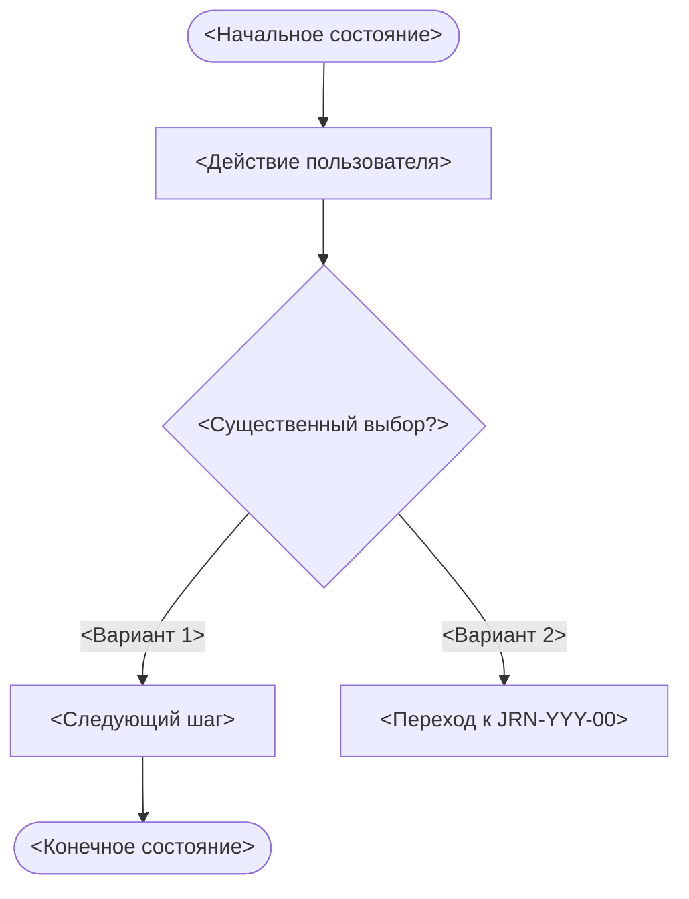

# `JRN-XXX-00 · <Название задачи пользователя>`

**Актор:** `<роль или роли, которые выполняют путь>`.
**Триггер:** `<событие или потребность, из-за которых пользователь начинает путь>`.
**Начальное состояние:** `<проверяемое состояние пользователя, системы и необходимых исходных данных>`.
**Цель:** `<результат, которого пользователь хочет достичь>`.
**Граница пути:** `<с какого действия начинается путь, каким состоянием заканчивается и что в него не входит>`.

---

## Основной путь

| Шаг | Действие пользователя                         | Реакция системы / результат                                             |
| --- | --------------------------------------------- | ----------------------------------------------------------------------- |
| 1   | `<конкретное действие пользователя>`          | `<наблюдаемая реакция системы или новое состояние>`                     |
| 2   | `<следующее действие или существенный выбор>` | `<реакция, результат, доступное продолжение или переход к другому JRN>` |
| 3   | `<...>`                                       | `<...>`                                                                 |

## Визуализация

---

## Результат

- `<достигнутое состояние пользователя>`;
- `<достигнутое состояние системы>`;
- `<состояние данных, связей или доступов, если оно относится к цели пути>`.

`<Пояснение результата, если завершение операции ещё не означает достижения цели пользователя. Удалить абзац, если пояснение не требуется.>`

---

## Связанные пути

- `JRN-YYY-00 · <Название>` — `<как путь связан с текущим: альтернатива, продолжение, возврат или отдельная задача>`.

---

## Открытые вопросы / гипотезы

1. **Открытый вопрос:** `<что необходимо решить и как это влияет на пользовательский путь>`.
2. **Гипотеза:** `<предлагаемый, но не утверждённый вариант и основание предложения>`.

<!-- Если открытых вопросов и гипотез нет, написать: «Нет». -->

---

## Связанные требования и сценарии

- `<ID>` — `<название или предмет требования / сценария>`.

<!-- Если формальная трассировка для карточки не ведётся, написать: «Не применяется» и указать причину. -->

---
