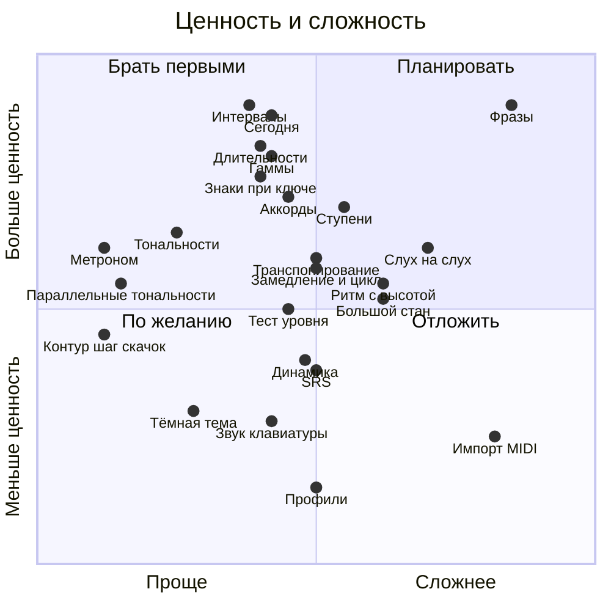
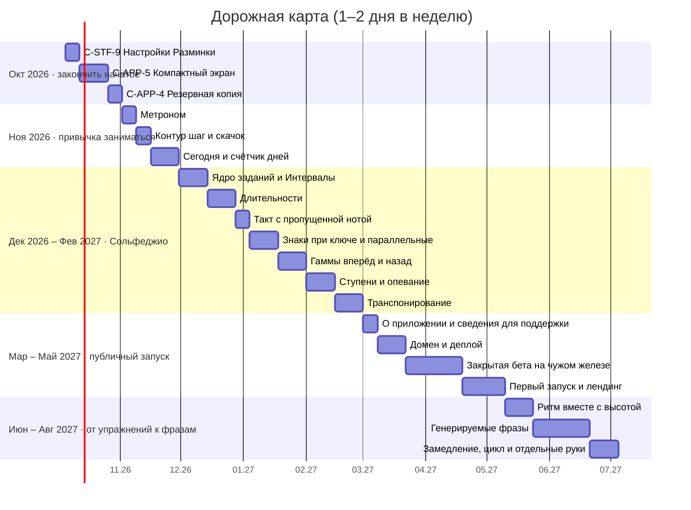
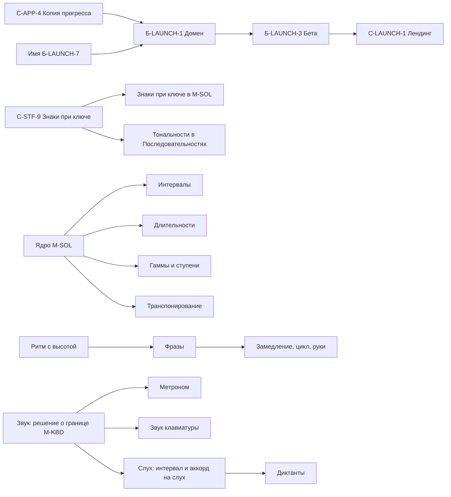

# Дорожная карта

> **Статус:** черновик, редакция 2 (04.10.2026) · **Владелец:** владелец проекта
> **Основание:** исследование рынка приложений для пианино (окт. 2026), обсуждение направления «Сольфеджио», паспорта модулей `PSD/specifications/`.

Карта — ориентир, а не обязательство. Нормативны только спецификации компонентов; здесь они получат номера, когда дойдёт очередь. Сольфеджио и всё остальное, что описано ниже, пока **не взято в работу**: сначала заканчиваем начатое.

## Исходные условия

- Цель: закрыть собственные потребности обучения, затем по возможности открыть тренажёр другим. Конкурировать с Simply Piano и другими не нужно, монетизации и продвижения нет (максимум ссылка на донаты и страница-лендинг).
- Ёмкость: 1–2 дня в неделю, владелец — продакт, вся разработка на Claude Code, процесс SDD + OpenSpec.
- Единица работы — один цикл `spec → propose → apply` (три PR плюс проверка на планшете). У тривиального proposal можно положить его в PR спецификации, тогда PR два.

### Калибровка сроков

Текущая версия сделана за два выходных (с 25.09 по 04.10): в архиве OpenSpec уже 18 change'ей, пик — около 8 в один день. Причина скорости: требования были формализованы в `PSD/` до кода, а вся разработка шла через Claude Code. Оценки ниже опираются на этот факт, с запасом ×1,5 на проверку на планшете, правки по ревью и то, что новые фичи уже меняют существующее поведение (нельзя ломать привычное).

| Размер | Что это | Работа владельца | Срок при 1–2 днях в неделю |
|---|---|---|---|
| S | Один небольшой цикл | ½–1 день | 1 неделя |
| M | Один полноценный цикл | 1–2 дня | 1–2 недели |
| L | Несколько циклов | 3–5 дней | 3–4 недели |
| XL | Не по ресурсам, не берём | — | — |

Срок упирается не в разработку, а в слияния PR и проверку на планшете, поэтому S и M занимают почти одинаково. Внешние задачи (домен, закрытая бета на чужом железе, согласование с людьми) не ускоряются Claude Code и считаются по календарю.

## Главное из исследований

- Наши сильные стороны, которые у конкурентов слабые: чтение нот без «падающих нот», оффлайн, никаких подписок и аккаунтов, русский язык.
- Доступность (крупно, контрастно, без тонких линий) в исследовании не упомянута ни у одного из девяти приложений. Это главный тезис лендинга.
- Фичи разучивания пьес (замедление, цикл, отдельные руки) нужны только после появления пьес или фраз.
- Микрофон, камера, AI-коуч, курсы и видео, аккаунты, рейтинги — не делаем (причины в таблице ниже).
- Сольфеджио на рынке: слух и интервалы покрыты хорошо (EarMaster, Perfect Ear, Functional Ear Trainer), российская школа сольфеджио с ответом игрой на пианино и крупным интерфейсом покрыта слабо. Это не рыночная ниша, а удобное совпадение: тренажёру нужна именно такая практика.

## Рынок: сольфеджио и слух

Источники — обзоры и страницы магазинов, приложения руками не проверялись.

| Приложение | Что покрывает |
|---|---|
| [EarMaster](https://earmaster.com/products/ear-training-sight-singing/earmaster-software.html) | Самое полное: интервалы, аккорды, диктанты, пение с листа; голос и хлопки, MIDI. Школьная версия, около 4000 уроков, примерно $5–24 в год на ученика |
| [Perfect Ear, Functional Ear Trainer](https://musiciangoods.com/blogs/music-theory/best-ear-training-apps) | Слух, теория, ритм; Perfect Ear бесплатно |
| Skoove | Теория, чтение с листа и слух внутри уроков; единственный из лидеров по пианино с явным слухом |
| Yousician | Теория и тренажёры; учитель может назначить упражнения на слух |
| Simply Piano | Упор на песни, теории и слуха мало |
| [«Мое сольфеджио»](https://www.rustore.ru/catalog/app/com.solfeggio.app), [«Слухачъ»](https://www.rustore.ru/catalog/app/com.slukhach.slukhach.free) | Локальные приложения RuStore: ноты в ключах, тональности, интервалы с ответом на клавиатуре; у первого тренировка снова на падающих нотах |

## Оценка фич конкурентов

### Уже есть или в работе

| Фича | Статус |
|---|---|
| MIDI, экранная клавиатура, нотный стан | реализовано |
| Ожидание ноты (wait mode) | есть по природе режимов (свой темп) |
| Оценка нот и ритма, адаптивность, «Что улучшилось» | реализовано (`C-STF-2…6`) |
| Оффлайн | реализовано |
| Ключи, тональности, бекар | `C-STF-9`, в работе |
| Язык (русский / English) | реализовано (`C-APP-3`) |
| Резервная копия, компактный экран | `C-APP-4`, `C-APP-5` в очереди |

### Берём в карту: упражнения и практика

| # | Фича | Размер | Заметка |
|---|---|---|---|
| 1 | Метроном | S | Первое решение про звук в проекте (сейчас звук исключён из `M-KBD`) |
| 2 | «Контур»: шаг / скачок | S | Уже в беклоге (`Б-STF-3`) |
| 3 | Тональности в «Последовательностях» | S–M | Использует движок знаков из `C-STF-9` |
| 4 | «Сегодня»: 5–10 заданий из трудных мест + счётчик дней без «сгорания» | M | Собирается из `practice-stats` |
| 5 | Чтение аккордов (трезвучия, обращения) | M | Войдёт в `M-SOL` отдельной волной |
| 6 | Ритм вместе с высотой | M–L | Уже в беклоге (`Б-STF-4`), мост к фразам |
| 7 | Генерируемые фразы для чтения с листа | L | Самая «потоковая» фича |
| 8 | Замедление, цикл, отдельные руки | M | Только поверх фраз (п. 7) |
| 9 | Динамика по velocity («играй ровно») | M | У конкурентов — только ROLI с камерой |
| 10 | Тест уровня чтения | M | Аналог SASR из Piano Marvel |
| 11 | Интервальные повторения (SRS) | M | Уже в беклоге (`Б-STF-1`) |
| 12 | Большой стан (обе руки) | M–L | |
| 13 | Тёмная тема | S–M | Уже в беклоге (`Б-APP-1`), нужна проверка контраста AAA |
| 14 | Звук экранной клавиатуры | M | Сэмплы 1–3 МБ в оффлайн-кеш |
| 15 | Профили учеников | M | Миграция хранилища в `.v2`, риск для данных |
| 16 | Импорт MIDI | L | Только при живом запросе пользователей |

### Берём в карту: сольфеджио (модуль `M-SOL`: свои задания по мотивам рабочей тетради)

| # | Фича | Размер | Заметка |
|---|---|---|---|
| 17 | Общее ядро заданий | M | Первым шагом вместе с интервалами; без него каждый режим дороже |
| 18 | Режим «Интервалы» (два варианта) | M | Лучший первый режим |
| 19 | Режим «Длительности» | M | Паузы — самое трудное |
| 20 | «Длительности»: такт с пропущенной нотой | M | Отдельный вариант режима |
| 21 | Режим «Знаки при ключе» | M | Зависит от `C-STF-9`; до 5 знаков на первом уровне |
| 22 | Режим «Параллельные тональности» | S | |
| 23 | Режим «Ступени» (включая опевание) | M–L | Нужна таблица правил, сверенная владельцем |
| 24 | Режим «Гаммы вперёд и назад» | M | Это знание, а не чтение |
| 25 | Режим «Транспонирование» | M | |
| 26 | Слух: интервал или аккорд на слух | M + M | После решения Р-1 про звук |
| 27 | Диктанты (слуховой, ритмический) | L | После п. 26 |
| 28 | Пение с листа по микрофону | L | Отложено: точность голоса неочевидна |

### Не делаем

| Фича | Причина |
|---|---|
| Микрофон для акустики | Хуже MIDI по надёжности; приоритет №1 — надёжность |
| Падающие ноты | Антипаттерн рынка, противоречит принципу «читаем потоком» |
| Курсы, видео рук, библиотека песен | Нужны методист и лицензии |
| Камера, AI-коуч, голос | Высокая цена; противоречит «всё локально» |
| Лиги, рейтинги, аккаунты, семейные тарифы | Противоречит `CLAUDE.md` §1 |
| Режим учителя | Лёгкая замена: ученик присылает файл копии из `C-APP-4` |
| Подсветка клавиш пианино | Зависит от модели, нужны sysex-команды |
| Импорт MusicXML | XL: произвольная вёрстка партитур |
| Задания из тетради «как есть» | Авторское право: переносим типы заданий, а не конкретные задачи; правила в подсказках пишем своими словами |

## Ценность и сложность

Позиция фичи на схеме по названию из таблиц выше. Ценность — для владельца-ученика с учётом публичного запуска.

## График

Пересчитан по калибровке сроков. Сольфеджио идёт сразу за «Сегодня», потому что владельцу нужно заниматься самому; публичный запуск после него. Если для тебя важнее запуск (решение Р-3), блок запуска можно поставить сразу после ноября, это сдвинет сольфеджио на три месяца.

Праздники и перерывы в график не заложены. Всё, что не на графике (динамика, тест уровня, SRS, тёмная тема, большой стан, звук клавиатуры, профили, слух и диктанты), берётся по желанию между блоками.

Если проверка MIDI на чужом железе кажется срочнее новых упражнений, закрытую бету (`Б-LAUNCH-3`) можно вставить раньше: приоритет №1 — надёжность.

## Зависимости

Порядок жёсткий: на новый домен не переезжаем до `C-APP-4` (потеря прогресса — худший сценарий, `CLAUDE.md` §7).

## Описание фич

Здесь каждая фича описана так, чтобы по заголовку можно было вспомнить, о чём шла речь. Это идеи, а не спецификации: решения и числа фиксируются в `C-XX-N` перед работой.

### Упражнения и практика

**1. Метроном.** Тихий щелчок в такт в режиме «Ритм» (и, по желанию, в других режимах). Зачем: ритм проще держать с опорой. Как: Web Audio, без загрузки файлов; громкость и частота настраиваются. Риск: это первый звук в проекте, а `M-KBD` исключает звук. Нужно решение Р-1; по умолчанию метроном выключен, и обратного отсчёта нет, чтобы не нарушать принцип «в своём темпе».

**2. «Контур»: шаг / скачок.** В режиме «Контур» кроме направления (вверх, вниз, на месте) различать секунду и более широкие интервалы. Зачем: следующий уровень режима, уже записан как `Б-STF-3`. Как: логика контура уже умеет считать направление; добавить порог размера интервала и один ответ из трёх вариантов. Риск минимальный.

**3. Тональности в «Последовательностях».** Ноты последовательности строятся в выбранной тональности со знаками при ключе. Зачем: читать надо не только в до мажоре. Как: подключить движок знаков из `C-STF-9`. Зависит от `C-STF-9`. Частично пересекается с режимом «Знаки при ключе» из `M-SOL`.

**4. «Сегодня» (5–10 заданий в день из трудных мест).** Один экран и одна кнопка: приложение смешивает несколько коротких заданий из разных режимов по твоим слабым местам и показывает, что стало лучше. Счётчик «занимался N дней» без серии, которая сгорает, и без наказаний. Зачем: привычка. Как: собирается из `practice-stats` и режимов. Подробнее про механику «как в Дуолинго» в п. 25.

**5. Чтение аккордов.** Название аккорда или его запись на стане: ученик играет трезвучие, обращение. Зачем: основа гармонии, для Simply Piano это целая ветка курса. Как: шаги из нескольких нот в «Последовательностях» уже есть; не хватает названий аккордов, обращений и генератора. Включается в `M-SOL` отдельной волной после основных режимов.

**6. Ритм вместе с высотой.** «Последовательности» с ритмом: ученик играет правильные ноты с правильной длительностью. Зачем: мост от упражнений к фразам. Как: объединить `C-STF-2` и `C-STF-6`; нужна запись длительностей. Размер M–L, уже записан как `Б-STF-4`.

**7. Генерируемые фразы для чтения с листа.** Короткие мелодии с ритмом, которые приложение генерирует само, а не хранит. Зачем: самая «потоковая» фича, к которой ведёт принцип «читаем потоком». Как: генератор мелодий по правилам (ступенчатое движение, ограниченные скачки, тональность), показ на стане, оценка нот и ритма. Размер L, зависит от п. 6. Открывает п. 8.

**8. Замедление, цикл, отдельные руки.** Работает только поверх фраз: сыграть фразу в замедленном темпе, закольцевать трудный такт, отработать каждую руку отдельно. Зачем: инструменты разучивания пьес из исследования, у лидеров они есть. Как: один движок воспроизведения фраз с множителем темпа, диапазоном тактов и выбором руки. Размер M после п. 7.

**9. Динамика по velocity.** Упражнение «играй ровно» (одинаковая громкость в последовательности) или «тише / громче». Зачем: у конкурентов динамику оценивает только ROLI и только с камерой, а velocity у нас уже приходит из MIDI. Как: считать разброс velocity в серии нажатий и показывать крупно. Размер M.

**10. Тест уровня чтения.** Фиксированный набор заданий, итог — уровень. Зачем: аналог SASR из Piano Marvel, ученик видит рост за месяцы. Как: набор из существующих режимов, шкала уровней, результат сохраняется в прогрессе. Размер M.

**11. Интервальные повторения (SRS).** Вместо простых весов по трудности — расписание повторений: освоенное реже, забытое чаще. Зачем: единственная доказанная часть механики Дуолинго, записана как `Б-STF-1`. Как: заменить веса в `practice-stats` на расписание; нужна миграция статистики без потери данных. Размер M, эффект виден через месяцы.

**12. Большой стан.** Обе руки на двух станах сразу. Зачем: настоящая игра двумя руками. Как: VexFlow умеет; сложнее генератор и проверка двух рук. Размер M–L.

**13. Тёмная тема.** Вторая палитра. Зачем: удобство вечером, записана как `Б-APP-1`. Риск: контраст AAA придётся проверять заново, светлая «бумага» остаётся основной. Размер S–M.

**14. Звук экранной клавиатуры.** Нажатие клавиши на экране издаёт звук пианино. Зачем: для тех, у кого нет пианино. Как: сэмплы 1–3 МБ в оффлайн-кеш, Web Audio. Размер M. Нужно решение Р-1.

**15. Профили учеников.** Несколько учеников на одном планшете, у каждого свой прогресс. Зачем: семья. Риск: миграция хранилища в `.v2`, это угроза данным владельца. Размер M, делать последним.

**16. Импорт MIDI.** Загрузка своего MIDI-файла и чтение его нот. Риск: квантование, разделение голосов, вёрстка на стане. Размер L, только если появится живой запрос. MusicXML (XL) не берём.

### Сольфеджио (`M-SOL`)

Режимы — авторская интерпретация владельца: обобщённые и доработанные задачи, которые он сам решал вручную в рабочей тетради по сольфеджио. Конкретных задач и заданий тетради в приложении нет, только идеи. Главная ценность — автоматическая проверка, которой нет у бумажной тетради. Звук для этих режимов не нужен: ответ играется на пианино или касанием экрана.

**Общие правила для всех режимов `M-SOL`:**
- Каждая идея — отдельный режим, вариации выбираются в настройках режима.
- Один ответ = одно нажатие: оценка сразу. Ответ = несколько нажатий (гамма, транспонирование): оценка после последней ноты, неверная нота красным, как надо — зелёным.
- Ответ-нота засчитывается только той высоты, что на нотном стане, с октавой. Ответ «клавиша = значение» (по легенде) засчитывается в любой октаве. На экранной клавиатуре вместо блокировки прокрутки используется авто-сдвиг по диапазону задания (механизм из `C-STF-9`): на планшете видно около полутора октав, а в интервалах нужны две.
- Для ответов «клавиша = значение» над клавишами показывается легенда (значок ноты, название интервала), и она должна помещаться в рабочую зону, потому что на компактном экране (`C-APP-5`) экранной клавиатуры нет.
- Статистика стандартная: угадал сразу, угадал не сразу, не угадал; самые трудные задания (больше всего попыток); ключ статистики — тип задания.
- Терминология: «размер» в тетради означает длительность ноты, а размер — это 2/4, 3/4 и так далее; «противоположные тональности» — это параллельные; «первая и вторая октава» — русская нумерация, а приложение называет ноты по-научному (C4), поэтому в подсказке нужна таблица соответствия.

**17. Общее ядро заданий.** Один каркас под все режимы: генератор заданий, таблица «клавиша → ответ», ограничение диапазона, проверка сразу и в конце, статистика по типу задания, легенда над клавишами. Зачем: восемь режимов по отдельности дорого, на общем ядре каждый следующий становится S–M. Как: первым change вместе с режимом «Интервалы». Это архитектурное решение, по `CLAUDE.md` его объясняем в описании PR.

**18. Режим «Интервалы».** Система пишет интервал и его направление (вверх или вниз), ученик нажимает вторую ноту. Стартовая нота — любая, в первой и второй октаве. Варианты (настройки):
- Нарисована первая нота и назван интервал: ученик играет вторую ноту.
- Нарисованы обе ноты: ученик нажимает клавишу, соответствующая интервалу. Лучшая схема: расстояние клавиши от до в полутонах и есть интервал (до — прима, до♯ — м2, ре — б2, ре♯ — м3, ми — б3, фа — ч4, фа♯ — тритон, соль — ч5, соль♯ — м6, ля — б6, ля♯ — м7, си — б7, до — ч8). Заучивать ничего не нужно, а готовых вариантов ответа нет.
Ограничения: ответ проверяется по высоте звука, поэтому увеличенная кварта и уменьшённая квинта неотличимы — принимаем обе.

**19. Режим «Длительности».** На стане отображаются ноты и паузы от целой до 1/16 в первой и второй октаве; ученик называет длительность, а не высоту. Ответ — клавиша: до — целая, ре — 1/2, ми — 1/4, фа — 1/8, соль — 1/16; легенда над клавишами обязательна. Высота ноты на ответ не влияет, но разные октавы тренируют взгляд на штили, флажки и связки. Самая коварная часть — паузы: целая и половинная различаются только положением относительно линии, такие пары надо давать чаще. Позже возможны точки: чёрная клавиша справа от белой = та же длительность с точкой. Статистика ключуется на «длительность × нота или пауза». Нотные рисунки уже частично есть в `rhythmDrawing.ts`.

**20. «Длительности»: такт с пропущенной нотой.** Один такт с заданным размером (2/4, 3/4, 4/4, 6/8), несколько нот и пауз, одного элемента не хватает в любом месте такта; ученик называет длительность недостающей. Как: генератор разбивает такт на длительности и скрывает одну. Нужно гарантировать, что скрытое значение выражается одной нотой, в том числе с точкой (чтобы не получилось 5/8 в 6/8). Скрытый элемент показывается акцентным вопросом, место в такте сохраняется.

**21. Режим «Знаки при ключе».** Система пишет название мажора или минора, ученик играет нужные диезы или бемоли чёрными клавишами в правильном порядке. Порядок диезов: фа, до, соль, ре, ля, ми, си; бемолей — си, ми, ля, ре, соль, до, фа. Шестой и седьмой знак приходятся на белые клавиши (ми♯ = фа, си♯ = до; до♭ = си, фа♭ = ми), поэтому на первом уровне берём не больше пяти знаков, а шесть и семь добавим позже с пояснением. Вариации: название тональности словами или знаки на стане; обратная задача: показаны знаки, ученик играет тонику. Названия тональностей зависят от языка интерфейса (до мажор, C major).

**22. Режим «Параллельные тональности».** Система пишет тональность словами (мажорную), ученик одной клавишей нажимает тонику параллельной минорной, и наоборот. Зачем: быстрое закрепление связи знаков при ключе. Ограничение: энгармонические пары (фа♯-мажор и соль♭-мажор) нажатием не различить, поэтому принимаем любое написание. На экранной клавиатуре диапазон ограничен большой октавой.

**23. Режим «Ступени».** Система пишет гамму и список ступеней, ученик нажимает их на клавиатуре в нужном порядке. Знак при ключе учитывается: если в тональности фа♯, верна чёрная клавиша, а не белая. Задания:
- тоническое трезвучие (I, III, V);
- устойчивые ступени (I, III, V);
- неустойчивые ступени (II, IV, VI);
- вводные ступени;
- опевание устойчивых ступеней: для заданной устойчивой ступени ученик нажимает две вводные к ней, нижнюю и верхнюю (например, в до мажоре для ступени до это си и ре) [?предположение: сверить формулировку и порядок нажатий с тетрадью].
Риск: «вводные» зависят от вида минора (в натуральном седьмая ступень не вводная, в гармоническом вводная), поэтому таблицу правил владелец сверяет с учебной теорией, а не пишем по памяти.

**24. Режим «Гаммы вперёд и назад».** Система показывает мажорную или минорную гамму и её вид (натуральный, гармонический, мелодический); ученик играет её вверх и вниз по памяти. Ошибки показываются только после проигрыша: неверная нота красным, как было нужно — зелёным. Конец ввода определяется фиксированным числом нот (8 вверх и 7 вниз). Первую ноту принимаем в любой октаве, остальные оцениваем относительно неё. Мелодический минор («вверх иначе, чем вниз») хорошо проверяет знание, а не угадывание. Размер M.

**25. Механика «5–10 заданий в день» (как в Дуолинго).** Сомнения владельца в эффективности обоснованы: у Дуолинго работает привычка, а не обучение. Доказанная часть — повторение с разнесением и мгновенная обратная связь (см. п. 11), а группировка в «уроки-плитки» — упаковка. Решение: в каждом режиме сессия = N заданий, как сейчас в «Последовательностях»; общий режим «Сегодня» (п. 4) смешивает 5–10 заданий из разных режимов по слабым местам, без жёстких уровней и без наказания за пропуск. Через месяц владелец сам оценит, помогает ли.

**26. Слух: интервал или аккорд на слух.** Приложение проигрывает интервал или аккорд, ученик называет или играет его. Зачем: настоящее сольфеджио начинается со слуха. Как: нужен звук (Р-1) и сэмплы; генератор тот же, что в `M-SOL`. Размер M + M за звук.

**27. Диктанты (слуховой, ритмический).** Приложение играет фразу, ученик записывает её игрой. Размер L, после п. 26.

**28. Пение с листа по микрофону.** Распознавание высоты голоса. Отложено: на фальшивящем голосе много ложных «неверно», надёжность хуже, чем у MIDI.

## Решения владельца

| # | Вопрос | Рекомендация | Статус |
|---|---|---|---|
| Р-1 | Разрешить ли приложению звучать? | Да, опционально, по умолчанию выключено | открыт; блокирует метроном, звук клавиатуры, слух |
| Р-2 | «Сегодня» и счётчик дней — совместимы ли с принципом «без провала»? | Да, если серия не сгорает | открыт |
| Р-3 | Порядок: сначала упражнения или сначала публичный запуск? | Сначала упражнения и сольфеджио, затем запуск | открыт |
| Р-4 | Новое имя | Выбрать до домена | открыт; блокирует `Б-LAUNCH-1`, лендинг |
| Р-5 | Платформа донатов | Решить при работе над лендингом; ссылка без кода | открыт |
| Р-6 | Сольфеджио начинается с общего ядра и режима «Интервалы» | — | принято 04.10.2026 |
| Р-7 | Любая октава на настоящем пианино, авто-сдвиг на экране вместо блокировки прокрутки | — | принято 04.10.2026 |
| Р-8 | Знаки при ключе: до пяти знаков на первом уровне | — | принято 04.10.2026 |
| Р-9 | Фото страниц тетради по каждому типу заданий (особенно ступени и интервалы) | Не нужны: режимы — интерпретация владельца, а не задачи тетради (`C-SOL-1`, Р-12) | закрыт |

## Как карта связана с паспортами

Принятые в работу пункты переносятся в беклог паспорта нужного модуля (`M-STF`, `M-APP`, `M-LAUNCH`, при взятии сольфеджио в работу — новый `M-SOL`) с меткой размера, затем получают спецификацию `C-XX-N` по обычному процессу (`PSD/README.md`). Карта обновляется при слиянии каждой такой спецификации.
