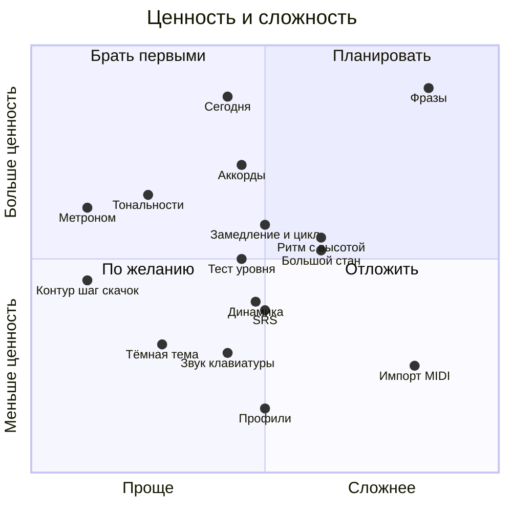
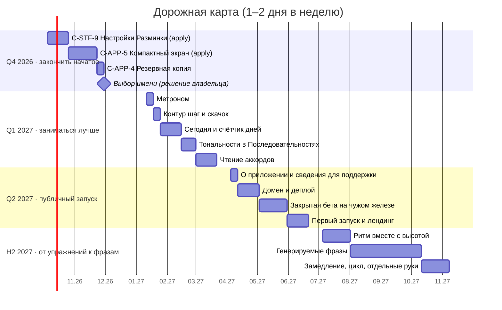
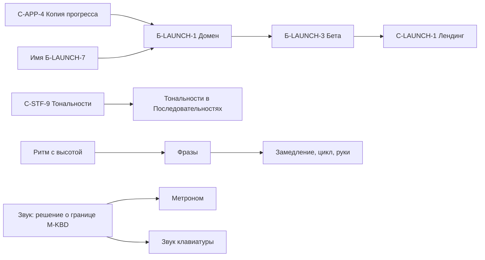

# Дорожная карта

> **Статус:** черновик, редакция 1 (03.10.2026) · **Владелец:** владелец проекта
> **Основание:** исследование рынка приложений для пианино (окт. 2026) и паспорта модулей `PSD/specifications/`.

Карта — ориентир, а не обязательство. Нормативны только спецификации компонентов; здесь они получат номера, когда дойдёт очередь.

## Исходные условия

- Цель: закрыть собственные потребности обучения, затем по возможности открыть тренажёр другим. Конкурировать с Simply Piano и другими не нужно, монетизации и продвижения нет (максимум ссылка на донаты и страница-лендинг).
- Ёмкость: 1–2 дня в неделю, владелец — продакт, вся разработка на Claude Code, процесс SDD + OpenSpec.
- Единица работы — один цикл `spec → propose → apply` (три PR плюс проверка на планшете).

| Размер | Что это | Срок |
|---|---|---|
| S | Один небольшой цикл | около 1 недели |
| M | Один полноценный цикл | 2–4 недели |
| L | Несколько циклов | 1,5–3 месяца |
| XL | Не по ресурсам, не берём | — |

## Главное из исследования

- Наши сильные стороны, которые у конкурентов слабые: чтение нот без «падающих нот», оффлайн, никаких подписок и аккаунтов, русский язык.
- Доступность (крупно, контрастно, без тонких линий) в исследовании не упомянута ни у одного из девяти приложений. Это главный тезис лендинга.
- Фичи разучивания пьес (замедление, цикл, отдельные руки) нужны только после появления пьес или фраз.
- Микрофон, камера, AI-коуч, курсы и видео, аккаунты, рейтинги — не делаем (причины в таблице ниже).

## Оценка фич конкурентов

### Уже есть или в работе

| Фича | Статус |
|---|---|
| MIDI, экранная клавиатура, нотный стан | реализовано |
| Ожидание ноты (wait mode) | есть по природе режимов (свой темп) |
| Оценка нот и ритма, адаптивность, «Что улучшилось» | реализовано (`C-STF-2…6`) |
| Оффлайн | реализовано |
| Ключи, тональности, бекар | `C-STF-9`, в работе |
| Язык (русский / English) | реализовано (`C-APP-3`) |
| Резервная копия, компактный экран | `C-APP-4`, `C-APP-5` в очереди |

### Берём в карту

| # | Фича | Размер | Заметка |
|---|---|---|---|
| 1 | Метроном | S | Первое решение про звук в проекте (сейчас звук исключён из `M-KBD`) |
| 2 | «Контур»: шаг / скачок | S | Уже в беклоге (`Б-STF-3`) |
| 3 | Тональности в «Последовательностях» | S–M | Использует движок знаков из `C-STF-9` |
| 4 | «Сегодня»: 5 минут из трудных мест + счётчик дней без «сгорания» | M | Собирается из `practice-stats` |
| 5 | Чтение аккордов | M | Шаги из нескольких нот уже есть |
| 6 | Ритм вместе с высотой | M–L | Уже в беклоге (`Б-STF-4`), мост к фразам |
| 7 | Генерируемые фразы для чтения с листа | L | Самая «потоковая» фича |
| 8 | Замедление, цикл, отдельные руки | M | Только поверх фраз (п. 7) |
| 9 | Динамика по velocity («играй ровно») | M | У конкурентов — только ROLI с камерой |
| 10 | Тест уровня чтения | M | Аналог SASR из Piano Marvel |
| 11 | Интервальные повторения (SRS) | M | Уже в беклоге (`Б-STF-1`) |
| 12 | Большой стан (обе руки) | M–L | |
| 13 | Тёмная тема | S–M | Уже в беклоге (`Б-APP-1`), нужна проверка контраста AAA |
| 14 | Звук экранной клавиатуры | M | Сэмплы 1–3 МБ в оффлайн-кеш |
| 15 | Профили учеников | M | Миграция хранилища в `.v2`, риск для данных |
| 16 | Импорт MIDI | L | Только при живом запросе пользователей |

### Не делаем

| Фича | Причина |
|---|---|
| Микрофон для акустики | Хуже MIDI по надёжности; приоритет №1 — надёжность |
| Падающие ноты | Антипаттерн рынка, противоречит принципу «читаем потоком» |
| Курсы, видео рук, библиотека песен | Нужны методист и лицензии |
| Камера, AI-коуч, голос | Высокая цена; противоречит «всё локально» |
| Лиги, рейтинги, аккаунты, семейные тарифы | Противоречит `CLAUDE.md` §1 |
| Режим учителя | Лёгкая замена: ученик присылает файл копии из `C-APP-4` |
| Подсветка клавиш пианино | Зависит от модели, нужны sysex-команды |
| Импорт MusicXML | XL: произвольная вёрстка партитур |

## Ценность и сложность

Позиция фичи по номерам из таблицы «Берём в карту». Ценность — для владельца-ученика с учётом публичного запуска.

## График

Если проверка MIDI на чужом железе кажется срочнее новых упражнений, закрытую бету (`Б-LAUNCH-3`) можно поставить в Q1 вместо аккордов: приоритет №1 — надёжность.

## Зависимости

Порядок жёсткий: на новый домен не переезжаем до `C-APP-4` (потеря прогресса — худший сценарий, `CLAUDE.md` §7).

## Решения владельца

| # | Вопрос | Рекомендация | Что блокирует |
|---|---|---|---|
| Р-1 | Разрешить ли приложению звучать? | Да, опционально, по умолчанию выключено | Метроном, звук клавиатуры |
| Р-2 | «Сегодня» и счётчик дней — совместимы ли с принципом «без провала»? | Да, если серия не сгорает | «Сегодня» |
| Р-3 | Порядок: сначала новые упражнения или сначала публичный запуск? | Сначала упражнения (Q1), затем запуск (Q2) | Весь график |
| Р-4 | Новое имя | Выбрать до домена | `Б-LAUNCH-1`, лендинг |
| Р-5 | Платформа донатов | Решить при работе над лендингом; ссылка без кода | Лендинг |

## Как карта связана с паспортами

Принятые в работу пункты переносятся в беклог паспорта нужного модуля (`M-STF`, `M-APP`, `M-LAUNCH`) с меткой размера, затем получают спецификацию `C-XX-N` по обычному процессу (`PSD/README.md`). Карта обновляется при слиянии каждой такой спецификации.
